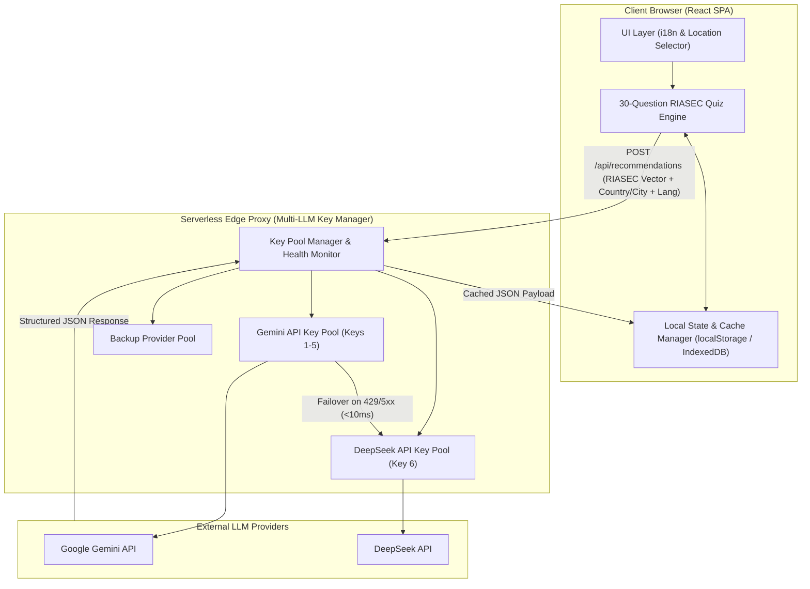

# System Architecture & Technical Specification
## Global Multi-LLM AI Career Assessment Engine

> **Document Status**: Approved Engineering Architecture  
> **Version**: 1.0.0  

---

## 1. High-Level System Architecture

The Global AI Career Assessment Platform is designed as a decoupled, edge-ready Single Page Application (SPA) backed by a resilient Multi-LLM Serverless Proxy Layer.



---

## 2. Multi-LLM Rotating API Key Engine Specification

### 2.1 Problem Statement & Requirements
In high-concurrency hackathons and global deployments, individual AI API keys hit rate limits (429 Too Many Requests), quota limits, or transient provider outages. Standard exponential backoff retry loops cause $5\text{s} - 30\text{s}$ delays, destroying user experience.

### 2.2 Rotator & Immediate Failover Algorithm
1. **Pool Configuration**:
   ```typescript
   interface APIKeyConfig {
     id: string;
     provider: 'gemini' | 'deepseek' | 'openai';
     apiKey: string;
     model: string;
     priority: number;
     status: 'active' | 'cooldown' | 'exhausted';
     cooldownUntil: number;
     errorCount: number;
   }
   ```
2. **Instant Rotation Protocol**:
   - The engine selects the highest-priority `active` key from the pool using weighted round-robin.
   - If the request succeeds, `errorCount` is reset to 0.
   - If the request returns $429$, $403$ (quota), $502$, or $503$, the key is **immediately marked as `cooldown`** for 60 seconds.
   - **Zero Retry Delay**: The manager catches the error in $< 2\text{ms}$ and *instantly* re-dispatches the request to the next available active key in the pool.
   - The user experiences zero artificial waiting time or backoff delays.

```typescript
// Conceptual Multi-LLM Key Pool Executor
export async function executeMultiLLMRequest(payload: RecommendationPayload): Promise<AIResponse> {
  const activeKeys = keyPool.filter(k => k.status === 'active' || Date.now() > k.cooldownUntil);
  
  for (const keyConfig of activeKeys) {
    try {
      const response = await fetchLLMProvider(keyConfig, payload);
      return response; // Success
    } catch (error) {
      if (isRateLimitOrQuotaError(error)) {
        keyConfig.status = 'cooldown';
        keyConfig.cooldownUntil = Date.now() + 60000; // 1 min cooldown
        console.warn(`Key ${keyConfig.id} rate-limited. Instantly rotating to next key...`);
        continue; // Immediately try next key in loop without delay
      }
      throw error;
    }
  }
  throw new Error('All API key pools temporarily exhausted. Please try again shortly.');
}
```

---

## 3. Client State & Cache Management Architecture

### 3.1 Progress Persistence Engine (Mid-Quiz Refreshes)
To prevent frustration from accidental browser refreshes, quiz state is automatically persisted.

```typescript
interface AssessmentState {
  version: number;
  location: { country: string; city: string };
  language: string;
  currentQuestionIndex: number;
  responses: Array<{
    questionId: number;
    selectedCode: 'R' | 'I' | 'A' | 'S' | 'E' | 'C';
    rating: 1 | 2 | 3;
    timestamp: number;
  }>;
  isCompleted: boolean;
}
```

- **Write Policy**: On every question submit/click, state is written to `localStorage` under key `global_quiz_state_v1`.
- **Hydration Protocol**: On component mounting, the app inspects `localStorage`. If valid uncompleted state exists, the UI renders a banner: *"Resume previous session at Question X?"* with options to **Resume** or **Start Fresh**.

### 3.2 Results Payload Cache Engine (Zero-Cost Reloads)
When AI recommendations are generated:
1. A deterministic hash of the user profile is generated:
   $$\text{ProfileHash} = \text{SHA256}(\text{RIASEC\_Scores} + \text{Country} + \text{City} + \text{Language})$$
2. The AI response is saved to `localStorage` under `global_results_cache_[ProfileHash]`.
3. Navigating to or refreshing the Results page checks for `ProfileHash` match. If present, it loads instantly from cache without consuming API quota.

---

## 4. Internationalization (i18n) & Location Engine

### 4.1 Multi-Language Architecture
- Powered by `i18next` and `react-i18next`.
- Translation dictionaries structured in `/src/locales/{lang}/`:
  - `translation.json`: UI labels, buttons, headers.
  - `questions.json`: Localized 30 questions and hints.
  - `riasec.json`: RIASEC dimension descriptions & archetype titles.

### 4.2 Country & City Selector Architecture
- **Data Source**: Integrated dataset of ISO 3166-1 countries and top global cities (> 15,000 cities).
- **Cascade Logic**: Selecting a Country filters the City dropdown options.
- **Payload Injection**: Country and City names are injected directly into the system prompt of the Multi-LLM engine:
  > *"Analyze the candidate's RIASEC profile for career opportunities specifically in **{City}, {Country}**. Include localized salary expectations in local currency and top regional employer hubs."*
