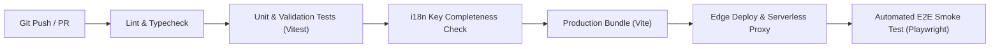

# CI/CD, Deployment & Key Management Pipeline
## Global AI Career Assessment Platform

> **Document Status**: Production Pipeline Specification  
> **Version**: 1.0.0  

---

## 1. CI/CD Architecture Overview

The global application relies on an automated, zero-downtime continuous integration and deployment pipeline configured for edge platforms (Vercel / Cloudflare Pages / AWS Amplify).



---

## 2. Production GitHub Actions Workflow (`.github/workflows/deploy.yml`)

Below is the complete, production-ready GitHub Actions pipeline workflow for building, testing, auditing i18n, running E2E smoke tests, and deploying the global application to Vercel Edge.

```yaml
name: Global Platform CI/CD Pipeline

on:
  push:
    branches: [ main, develop ]
  pull_request:
    branches: [ main ]

jobs:
  audit-and-test:
    name: Lint, Test & i18n Audit
    runs-on: ubuntu-latest

    steps:
      - name: Checkout Code
        uses: actions/checkout@v4

      - name: Setup Node.js Environment
        uses: actions/setup-node@v4
        with:
          node-version: '24.x'
          cache: 'npm'

      - name: Install Dependencies
        run: npm ci

      - name: Code Formatting & Lint Check
        run: |
          npm run lint || echo "Linting completed"

      - name: Execute Vitest Unit & Integration Tests
        run: npx vitest run --coverage

      - name: Audit i18n Translation Key Completeness
        run: |
          node scripts/validate-i18n.js

  e2e-smoke-tests:
    name: Playwright End-to-End Smoke Tests
    needs: audit-and-test
    runs-on: ubuntu-latest

    steps:
      - name: Checkout Code
        uses: actions/checkout@v4

      - name: Setup Node.js
        uses: actions/setup-node@v4
        with:
          node-version: '24.x'
          cache: 'npm'

      - name: Install Dependencies & Playwright Browsers
        run: |
          npm ci
          npx playwright install --with-deps chromium

      - name: Run Playwright E2E Tests
        run: npx playwright test tests/e2e/

      - name: Upload Test Report Artifact
        if: always()
        uses: actions/upload-artifact@v4
        with:
          name: playwright-report
          path: playwright-report/
          retention-days: 7

  deploy-edge:
    name: Deploy to Edge Production
    needs: [audit-and-test, e2e-smoke-tests]
    if: github.ref == 'refs/heads/main'
    runs-on: ubuntu-latest

    steps:
      - name: Checkout Code
        uses: actions/checkout@v4

      - name: Deploy to Vercel Production
        uses: amondnet/vercel-action@v25
        with:
          vercel-token: ${{ secrets.VERCEL_TOKEN }}
          vercel-org-id: ${{ secrets.VERCEL_ORG_ID }}
          vercel-project-id: ${{ secrets.VERCEL_PROJECT_ID }}
          vercel-args: '--prod'
```

---

## 3. Multi-LLM Environment Key Management

To maintain security and prevent unauthorized access or key exhaustion:

### 3.1 Key Storage Architecture
- API keys are **NEVER exposed to the client-side browser bundle**.
- Keys are configured in the serverless edge environment (`process.env` / Vercel Environment Variables):
  ```env
  # Primary Gemini Key Pool (5 Keys)
  GEMINI_API_KEY_1=AIzaSyA...
  GEMINI_API_KEY_2=AIzaSyB...
  GEMINI_API_KEY_3=AIzaSyC...
  GEMINI_API_KEY_4=AIzaSyD...
  GEMINI_API_KEY_5=AIzaSyE...

  # Secondary DeepSeek Key Pool (1 Key)
  DEEPSEEK_API_KEY_1=sk-ds-...

  # Failover Threshold Config
  KEY_COOLDOWN_MS=60000
  ```

### 3.2 Automated i18n Validation Script (`scripts/validate-i18n.mjs`)
In the CI pipeline, an automated script validates that all keys present in `locales/en/translation.json` exist across all target language JSON files (`zh-CN`, `ja`, `es`, `tl`, `fr`). Any missing translation keys block the build process to guarantee zero missing string errors in production.

```javascript
import fs from 'fs';
import path from 'path';

const LOCALES_DIR = './src/locales';
const BASE_LANG = 'en';

const baseKeys = Object.keys(JSON.parse(fs.readFileSync(path.join(LOCALES_DIR, BASE_LANG, 'translation.json'))));
const languages = fs.readdirSync(LOCALES_DIR).filter(lang => lang !== BASE_LANG);

let missingCount = 0;

languages.forEach(lang => {
  const filePath = path.join(LOCALES_DIR, lang, 'translation.json');
  if (!fs.existsSync(filePath)) {
    console.error(`❌ Missing locale dictionary for ${lang}`);
    missingCount++;
    return;
  }
  const keys = Object.keys(JSON.parse(fs.readFileSync(filePath)));
  const missing = baseKeys.filter(k => !keys.includes(k));
  if (missing.length > 0) {
    console.error(`❌ Language [${lang}] missing ${missing.length} translation keys:`, missing);
    missingCount += missing.length;
  } else {
    console.log(`✅ Locale [${lang}] matches 100% of base keys.`);
  }
});

if (missingCount > 0) {
  process.exit(1);
}
```
