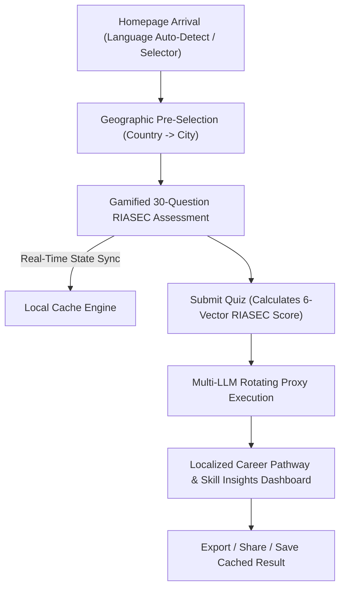

# Business Process & Global Career Guidance Strategy
## Global AI Career Assessment Platform

> **Document Status**: Strategic Architecture Document  
> **Version**: 1.0.0  

---

## 1. Business Process & User Journey Model

The platform redefines vocational career guidance by transforming static catalog searches into a dynamic, AI-driven global discovery pipeline.

---

## 2. Global Scalability & Impact Strategy

### 2.1 Regional Adaptation Engine
Unlike traditional career portals that only serve a single country, the global platform adapts to local economic demands:
- **Tier 1 Tech & Innovation Hubs (e.g. Tokyo, Silicon Valley, Singapore, Shenzhen)**: Emphasizes high-tech AI, software engineering, robotics, and quantitative research pathways.
- **Industrial & Trade Centers (e.g. Frankfurt, Nagoya, Cavite)**: Highlights mechanical engineering, trade mastery, logistics, and supply chain roles.
- **Creative & Cultural Capitals (e.g. Paris, Milan, London, Seoul)**: Focuses on digital media, fashion design, gaming, and visual arts.

### 2.2 Hackathon Innovation Highlights
1. **Zero-Latency Multi-LLM Key Rotation**: Solves the universal AI hackathon failure mode of API quota exhaustion during live judging or viral traffic spikes.
2. **Offline-First Persistence**: Instant reload and state recovery ensure unbroken demonstration even during unstable network connections.
3. **Inclusive Multi-Lingual UX**: Breaking down language barriers for non-English native judges and users across Asia, Europe, and Latin America.
