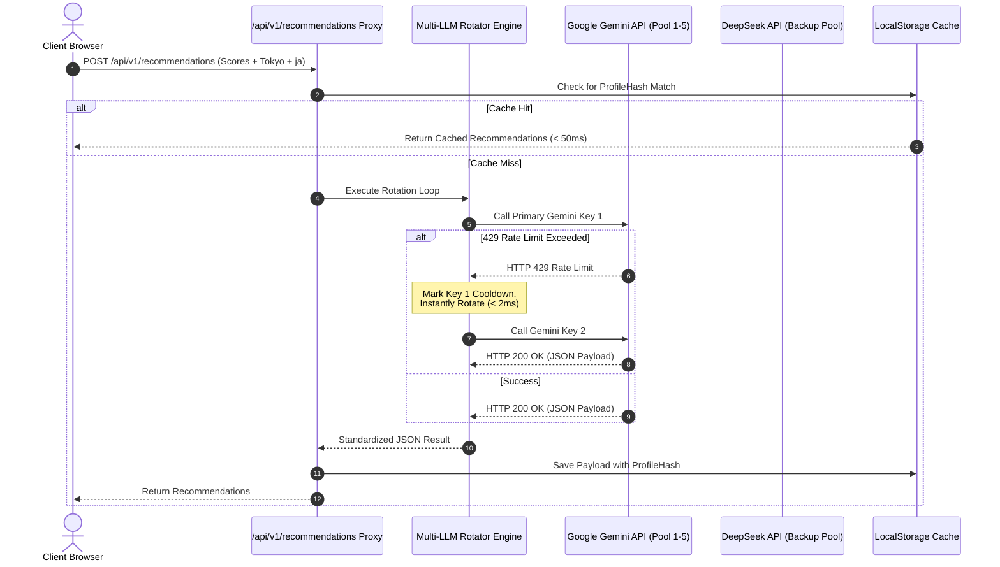

# API Specification & Vector Matching Algorithm Reference
## Global AI Career Assessment Platform

> **Document Status**: Production Technical Specification  
> **Version**: 1.0.0  

---

## 1. Executive Overview

This document specifies the **Mathematical Matching Algorithm** and **REST API Specifications** that power the Global AI Career Platform. It details how RIASEC 6-vector scoring, continuous Pearson correlation matching, localized career path generation, educational hub discovery, and multi-LLM rotation are executed.

---

## 2. Mathematical Scoring & Profile Correlation Engine

### 2.1 Raw & Normalized Score Calculation
Given a user's set of responses $R = \{(q_i, \text{code}_i, \text{rating}_i)\}_{i=1}^{30}$ where $\text{rating}_i \in \{1, 2, 3\}$:

1. **Raw Vector Calculation**:
   $$\text{RawScore}(D) = \sum_{i \in \text{selected responses for } D} \text{rating}_i, \quad D \in \{R, I, A, S, E, C\}$$

2. **Opportunity Normalization Formula**:
   $$\text{Score}(D) = \left( \frac{\text{RawScore}(D) \times \max_{k} N_k}{N_D} \right)$$
   Where $N_D$ is the total appearances of dimension $D$ across the 30 questions ($N_R=10, N_I=11, N_A=9, N_S=10, N_E=9, N_C=11$), and $\max_k N_k = 11$.

---

### 2.2 Continuous 6-Vector Pearson Correlation Matching

Instead of rigid 2-letter string comparisons, career fit is computed continuously across all 6 dimensions using the **Pearson Vector Correlation Coefficient**:

$$r(u, c) = \frac{\sum_{i=1}^{6} (u_i - \bar{u})(c_i - \bar{c})}{\sqrt{\sum_{i=1}^{6} (u_i - \bar{u})^2} \sqrt{\sum_{i=1}^{6} (c_i - \bar{c})^2}}$$

Where:
- $u = [u_R, u_I, u_A, u_S, u_E, u_C]$ is the candidate's normalized RIASEC score vector.
- $c = [c_R, c_I, c_A, c_S, c_E, c_C]$ is the reference 6-dimensional career vector.
- $\bar{u}$ and $\bar{c}$ are the vector means.

#### Match Percentage Formula:
$$\text{MatchPercent} = \text{Math.round}\left( \frac{r(u, c) + 1}{2} \times 100 \right)$$

---

## 3. REST API Endpoint Specifications

### 3.1 Endpoint 1: Calculate RIASEC Score Vector
* **URL**: `POST /api/v1/assessment/calculate-score`
* **Content-Type**: `application/json`
* **Description**: Takes raw response choices and returns normalized RIASEC vector & archetype profile.

#### Request Payload:
```json
{
  "responses": [
    { "questionId": 1, "selectedCode": "R", "rating": 3 },
    { "questionId": 2, "selectedCode": "A", "rating": 2 }
  ]
}
```

#### Response Payload:
```json
{
  "status": "success",
  "data": {
    "normalizedScores": { "R": 8.8, "I": 9.5, "A": 4.2, "S": 3.0, "E": 6.1, "C": 7.7 },
    "topDimensions": [
      { "code": "I", "score": 9.5 },
      { "code": "R", "score": 8.8 }
    ],
    "archetypeCode": "IR",
    "archetypeTitle": "The Pathfinder"
  }
}
```

---

### 3.2 Endpoint 2: Multi-LLM AI Recommendations (Careers, Universities, Skills)
* **URL**: `POST /api/v1/recommendations`
* **Content-Type**: `application/json`
* **Description**: Triggers the Multi-LLM Rotating Engine (Gemini/DeepSeek) with automatic rate-limit failover. Generates localized career pathways, top regional universities/hubs, and skill roadmaps tailored to the candidate's Country, City, and Language.

#### Request Payload:
```json
{
  "profile": {
    "normalizedScores": { "R": 8.8, "I": 9.5, "A": 4.2, "S": 3.0, "E": 6.1, "C": 7.7 },
    "archetypeCode": "IR"
  },
  "location": {
    "country": "Japan",
    "city": "Tokyo"
  },
  "language": "ja"
}
```

#### Response Payload (Structured JSON):
```json
{
  "status": "success",
  "meta": {
    "cached": false,
    "providerUsed": "gemini-1.5-flash",
    "latencyMs": 1140
  },
  "recommendations": {
    "careers": [
      {
        "id": "robotics-engineer",
        "title": "ロボット工学エンジニア (Robotics Engineer)",
        "matchPercent": 94,
        "description": "Tokyo is a global hub for industrial and service robotics. Your high Investigative and Realistic scores fit autonomous systems engineering.",
        "avgSalaryLocal": "¥8,500,000 / 年",
        "demandOutlook": "Very High",
        "topEmployers": ["Sony", "FANUC", "Toyota Research Institute"]
      },
      {
        "id": "ai-research-scientist",
        "title": "AI研究研究員 (AI Research Scientist)",
        "matchPercent": 91,
        "description": "High analytical curiosity aligns with computer vision and machine learning model development in Kanto tech hubs.",
        "avgSalaryLocal": "¥10,200,000 / 年",
        "demandOutlook": "Extremely High",
        "topEmployers": ["Preferred Networks", "Rakuten", "RIKEN"]
      }
    ],
    "educationAndTraining": [
      {
        "institution": "東京大学 (The University of Tokyo)",
        "program": "工学部 情報工学科 (Department of Information & Communication Engineering)",
        "type": "University",
        "location": "Bunkyo, Tokyo"
      },
      {
        "institution": "東京工業大学 (Tokyo Institute of Technology)",
        "program": "工学院 機械系 (School of Engineering - Mechanical)",
        "type": "University",
        "location": "Meguro, Tokyo"
      }
    ],
    "skillDevelopment": [
      "Python / C++ Robotics Software Development",
      "ROS 2 (Robot Operating System)",
      "Mathematical Optimization & Sensor Fusion"
    ]
  }
}
```

---

## 4. Multi-LLM Execution Flow Sequence


